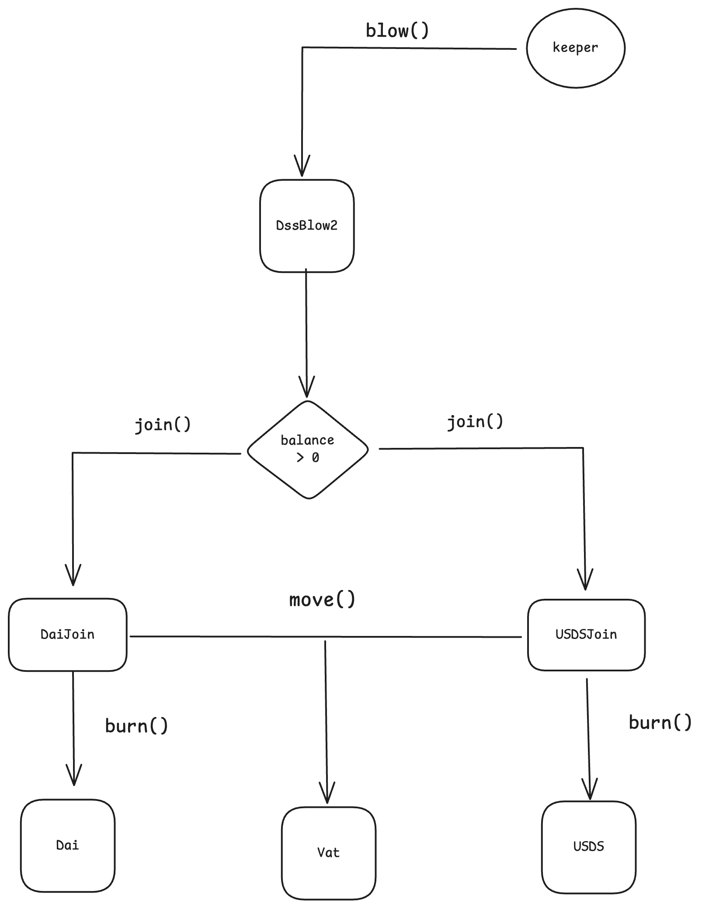

# dss-blow2

## Description

`dss-blow2` is a smart contract designed to facilitate the refunding of Dai or USDS to the Sky Protocol.

## Overview

There are a few actions that are harder than expected when interacting with the Sky Protocol. For instance, returning Dai/USDS to SkyDAO is a non-trivial operation for users who are not familiar with the protocol’s inner workings.

From an accounting perspective, any returns made should be considered extra revenue. However, the protocol's revenue is not stored anywhere within the system. Instead, the closest representation is the **Surplus Buffer**, which can be roughly described as a _quasi_-instant snapshot of Sky's accumulated profits. More information on that can be found in [this article](https://hackmd.io/@infomorph/rJ7Wjcrai).

Technically speaking, the Surplus Buffer is calculated as the internal balance of the [`Vow`](https://etherscan.io/address/0xa950524441892a31ebddf91d3ceefa04bf454466) (`vat.dai(vow)`) minus the total bad debt in the system (`vat.vice`):

```
surplus_buffer = vat.dai(vow) - vat.vice
```


Thus, the "correct" way to return Dai/USDS to the protocol is by incorporating them into the Surplus Buffer. The downside is that there is no associated address for the Surplus Buffer—it is merely a data entry in the `Vat`.

Instead of making a standard ERC-20 transfer, anyone wishing to return tokens to the protocol must:

1. Call `dai.approve(daiJoin, amt)` or `usds.approve(usdsJoin, amt)` to allow [`daiJoin`](https://etherscan.io/address/0x9759a6ac90977b93b58547b4a71c78317f391a28) or [`usdsJoin`](https://etherscan.io/address/0x3c0f895007ca717aa01c8693e59df1e8c3777feb) to spend Dai/USDS.
2. Call `daiJoin.join(vow, amt)` or `usdsJoin.join(vow, amt)` to burn the ERC-20 Dai/USDS and incorporate it into the Surplus Buffer.

Both operations can be challenging (if not impossible) due to wallet limitations and tend to be error-prone.

The original [`DssBlow` contract](https://etherscan.io/address/0x0048fc4357db3c0f45adea433a07a20769ddb0cf#code) was created as a standard ERC-20 "bridge" between users and the Sky Protocol. It allows any user to simply transfer Dai to it, and a permissionless function named `blow()` then incorporates the outstanding Dai balance of the contract into the Surplus Buffer.

While `DssBlow` works well for Dai, the same approach would not work for USDS, since the Sky Ecosystem has adopted the new native stablecoin. `DssBlow2` is capable of handling both Dai and USDS simultaneously:

- **Unified Address:** Users can send Dai or USDS to the **same address**—the `DssBlow2` instance.
- **Single Entry Point:** Anyone can call `blow()`, which will add both the outstanding Dai and USDS balances to the Surplus Buffer at the same time.
- **Function Override Consideration:** The `blow(uint256 wad)` override does not make much sense in this context. It should either be removed or modified to `blow(address nat, uint256 wad)` to allow users to specify which native token they wish to use in the transaction.

## Solution Design

The primary design principle is simplicity. `DssBlow2` will function similarly to `DssBlow`, with the `blow()` function handling the return of both `DAI` and `USDS` to the protocol. Although this function is permissionless, it is expected to be invoked periodically—either by a keeper or directly by a user. As mentioned earlier, there is no need for an override function. Each time `blow()` is called, the contract’s Dai and USDS balances will be checked to determine whether a transfer is necessary. The logic and frequency of invocation will be managed at the keeper level, especially if a cron job is implemented.

We decided to pass the necessary addresses (i.e., `daiJoin`, `usdsJoin`, and `vow`) as constructor arguments. The `dai` and `usds` ERC-20 contracts are obtained via their corresponding joins. In the rare event that one of the relevant addresses changes, the contract would need to be redeployed.



## Installation

To install the project, clone the repository and set up the necessary dependencies:

```bash
git clone https://github.com/dewiz-xyz/dss-blow2.git
cd dss-blow2
forge install
